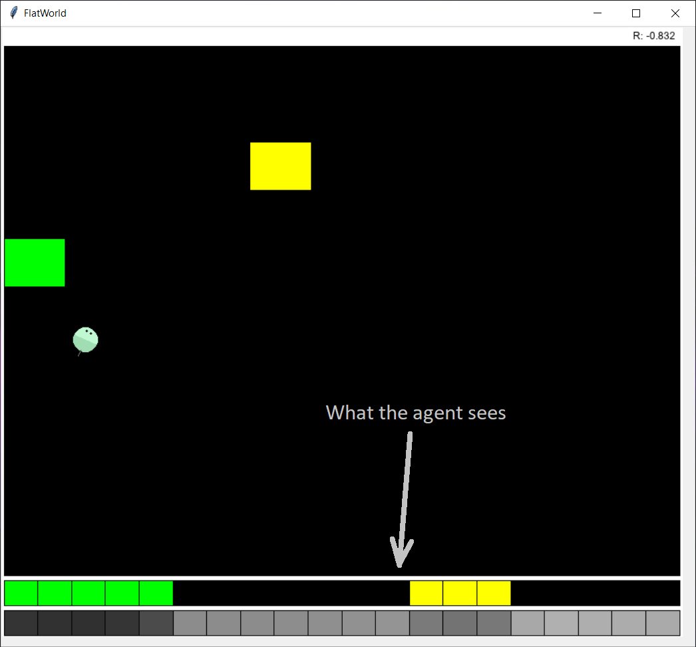
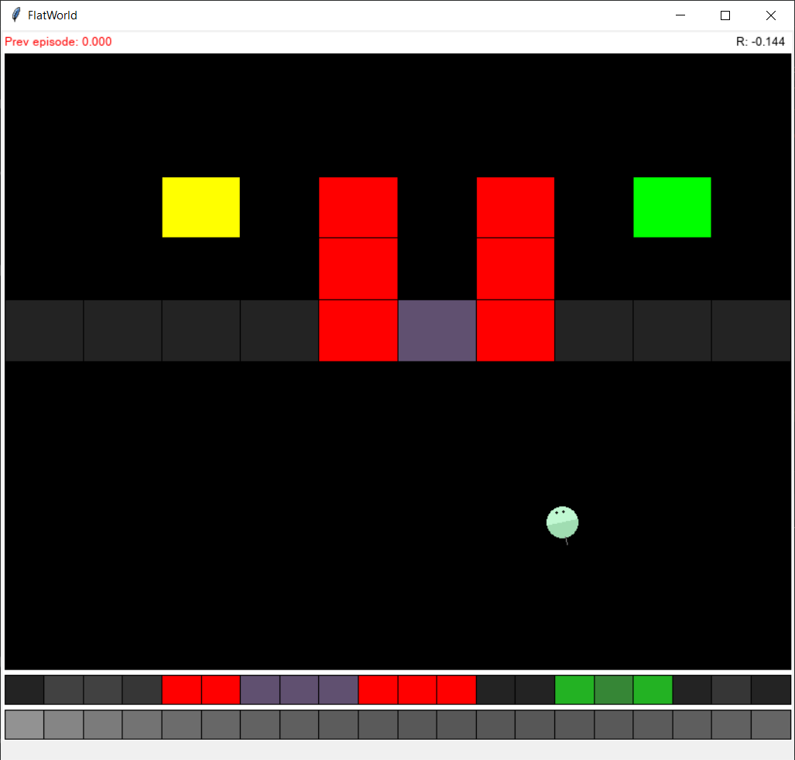

# FlatWorld

FlatWorld offers an [OpenAI Gym](https://github.com/openai/gym) environment designed for Reinforcement Learning research. 
It's similar to a gridworld, except agents in FlatWorld perceive the world through a 1D image that 
serves as a projection of the underlying 2D environment. This 1D image of 20 pixels (by default) 
consists of four channels: three for color information and one for depth.

## Installation

    pip install flat-world

## Basic usage

      from flat_world.FlatWorldEnvironment import FlatWorldEnvironment
      from flat_world.tasks.starter_2_config import Starter2Config
      
      env = FlatWorldEnvironment(Starter2Config())
      # Use env like an OpenAI gym environment

The argument passed to the `FlatWorldEnvironment` constructor is an instance of a class
that extends `FlatWorldConfig` or `FlatWorldMultiAgentConfig`. Multiple examples can
be found in the `flat_world/tasks` folder.

## Running the environment interactively

Use code similar to this:

    from flat_world.ActuatorType import ActuatorType
    from flat_world.FlatWorldEnvironment import FlatWorldEnvironment
    from flat_world.tasks.simple_food_2_config import SimpleFood2Config

    _params = dict(
        actuator_type=ActuatorType.DUAL,
        reward_no_action=0,
        default_reward=-0.004,
    )
    env = FlatWorldEnvironment(SimpleFood2Config(), **_params) 
    observation = env.reset()
    while not env.is_closed:
        # Render the environment
        env.render()
        # Actions come from keyboard
        action = env.pull_next_keyboard_action()
        observation, reward, done, info = env.step(action)
        if done:
            observation = env.reset()

There is also a script in `tools/try_environment.py` for single-agent configurations
and in `toosl/try_multiagent_env.py` for multi-agent configurations.

This is what the interactive interface looks like when rendering a simple environment that consists of a green food and a yellow food:

This is a more elaborate environment with transparent walls and a pushable box:

## Default Actions

When the `actuator_type` parameter passed to `FlatWorldEnvironment` is the default (`ActuatorType.DEFAULT`)
the actions provided by the environment will be one of:

- NONE (0)
- LEFT (1)
- RIGHT (2)
- FORWARD (3)
- BACK (4)
- TOGGLE (5) - Toggles color of agent

## Booster Actions

Booster-like actions are supported by passing an `actuator_type` parameter
equal to `ActuatorType.BOOSTERS_2` (2 boosters) or `ActuatorType.BOOSTERS_4` (4 boosters).

The action vector provided to the environment will have a length equal
to the number of boosters. Each value (or booster power) of the vector 
must be between -1 and +1.

The first two boosters (0 and 1) are located on the left and 
right sides of the agent, respectively. If booster power is positive, 
the booster fires upward. If power is negative,
the booster fires downward.

Boosters 2 and 3 are located on the tail and head of the agent,
respectively. If booster power is positive, these boosters 
fire in a rightward direction. If power is negative, they 
fire in a leftward direction. Boosters 2 and 3 allow 
the agent to move sideways without turning.

When a booster fires, it creates both angular and linear 
acceleration. This acceleration only has an effect for
a certain number of steps, due to friction.

## Dual Actuator

Actions that behave similar to those of the 
Animal AI testbed can be simulated by passing
an `actuator_type` parameter to the environment constructor
with a value of `ActuatorType.DUAL`.

The action vector provided to the environment should
have two values. The first value selects from Forward
and Back. The second value selects from Right and Left. 
Each value can be 0 (no action), 1 (Forward/Right) or 
2 (Back/Left).

## Types of elements

Custom elements can be defined. The following are the standard pre-defined elements:

- Yellow food (`FlatWorldElement.food`) - Gives 1.0 rewards when consumed.
- Green food (`FlatWorldElement.final_food`) - Gives 1.0 rewards when consumed and ends the episode.
- Blue food (`FlatWorldElement.final_food_2`) - Gives 0.5 rewards when consumed, and ends the episode.
- Fence (`FlatWorldElement.fence_brick`) - Gives -1.0 rewards when hit, and ends the episode.
- Translucent (`FlatWorldElement.translucent_brick`) - It's solid. The agent can see through it.
- Box (`FlatWorldElement.box`) - A box is a tool that can be pushed by the agent. Moving a box into a fence or wall brick destroys the brick. Moving a box into a blue food turns it into a green food. A box can also displace yellow and green foods.
- Wall (`FlatWorldElement.wall_brick`) - A solid opaque brick.

## Episodes

Episodes end when the agent consumes a green food, blue food, hits a fence,
or is eaten by a predator.
An episode also ends if the cumulative reward of the agent reaches -1 (by default).

With every step the agent is awarded -0.01 rewards, unless
a `default_reward` parameter is passed to the constructor
of the environment.

To change the cumulative reward lower bound, override the `get_min_cumulative_reward`
method of `FlatWorldConfig`.

## Observation

The observation is a 4x20 numpy array by default. That's 20 pixels
with 4 channels. Three channels are for color, one for depth. 

The default resolution of 20 pixels can be changed by passing
an `obs_resolution` parameter to the environment constructor.

The depth channel is calculated from the observed *depth* in 
grid cells, as follows:

    dc = 255 * depth / (depth + 5)

In multi-agent mode, the observation is batched, so its
shape will be Bx4x20 by default. `B` cannot be 1 unless
the `squeeze` parameter is set to `False`.

## Info

An 'info' value is provided when an episode ends.
It's a dictionary containing a `completion` 
property with one of the following string values:
"killed", "success", "ran_out".

## Single-agent configuration

Extend class `FlatWorldConfig`, as in the following example:

    import math
    from typing import List, Tuple, Union
    from flat_world.FlatWorldElement import FlatWorldElement
    from flat_world.FlatWorldConfig import FlatWorldConfig
    
    
    class OneBrickConfig(FlatWorldConfig):
        def get_initial_agent_position(self) -> Tuple[int, int]:
            return 2, 2,
    
        def get_initial_agent_angle(self) -> float:
            return math.pi / 2
    
        def get_elements(self, agent_x, agent_y) -> List[object]:
            elements = []
            for b in range(1):
                elements.append(FlatWorldElement.fence_brick((6, b + 6)))
            return elements

Elements are placed in grid positions. The default
grid size is 10x10. Agents are also initially placed
in grid positions, even though they have greater freedom
of movement than one grid step.

The provided initial agent angles can be arbitrary, 
but they get discretized: 30-degree steps by default.

## Multi-agent configuration

Extend class `FlatWorldMultiAgentConfig`, as in the following example:

    import math
    import numpy as np
    from typing import Union, List, Tuple
    from flat_world.FlatWorldElement import FlatWorldElement
    from flat_world.FlatWorldMultiAgentConfig import FlatWorldMultiAgentConfig
    
    
    class MultiAgentBoxConfig(FlatWorldMultiAgentConfig):
        def get_min_cumulative_reward(self):
            return -3.0
    
        def get_initial_agent_angles(self, num_agents: int) -> Union[List[float], np.ndarray]:
            return self.random.uniform(0, 2 * math.pi, size=num_agents)
    
        def get_initial_agent_positions(self, num_agents: int) -> List[Tuple[int, int]]:
            g_w, g_h = self.get_grid_size()
            positions = self.random.choice(range(g_w * g_h), size=num_agents, replace=False)
            return [(p % g_w, p // g_w) for p in positions]
    
        def get_elements_for_agents(self, initial_agent_positions: List[Tuple[int, int]]) -> List[FlatWorldElement]:
            g_w, g_h = self.get_grid_size()
            pos_set = set(initial_agent_positions)
            box_pos: Tuple[int, int] = None
            for attempt in range(100):
                bp = self.random.randint(1, g_w - 1), self.random.randint(1, g_h - 1)
                if bp not in pos_set:
                    box_pos = bp
                    break
            if box_pos is None:
                return []
            return [FlatWorldElement.box(box_pos)]

To initialize an environment for a multi-agent configuration,
pass a `num_agents` parameter to the constructor of `FlatWorldEnvironment`.

If `num_agents` is greater than 1, the 'action' provided in each
step must be a list of actions, one per agent. The 'observation'
will be provided as a batch of agent observations. The 'reward'
and 'done' values are provided as numpy arrays.

With more agents, the environment grid may need to be bigger
and the agent's visual resolution higher. To change the
default grid size override the `get_grid_size` method
of the configuration class. To change the default
resolution, pass an `obs_resolution` parameter to the
environment constructor.

To try the environment interactively:

    import math
    import gym
    import numpy as np
    from flat_world.FlatWorldEnvironment import FlatWorldEnvironment
    from flat_world.tasks.multi_agent.multiagent_box_config import MultiAgentBoxConfig
    
    env = FlatWorldEnvironment(MultiAgentBoxConfig(),
                               reward_no_action=0, 
                               num_agents=3, obs_resolution=50)
    
    observation = env.reset()
    while not env.is_closed:
        env.render()
        action = env.pull_next_keyboard_action()
        observation, reward, done, info = env.step(action)
        if np.all(done):
            observation = env.reset()

When `num_agents` is 1, 'reward' and 'done' are scalars, 
and the observation is not batched. This is the typical
gym environment behavior.  You can, however, 
force batching behavior with a single agent
by passing an `squeeze=False` parameter 
to the environment constructor.

## Predators

Predators can be added to a configuration by overriding
the `get_initial_predator_positions` method. The level
of difficulty can be set by passing a `predator_level`
parameter to the environment constructor.

When a predator eats an agent, the agent is awarded
-1.0 rewards, and the episode ends for that agent.

## Randomization

To ensure reproducibility in an environment configuration, use `self.random` instead
of `np.random` to produce random numbers. If the 
configuration class has a constructor, make sure it
calls the constructor of the superclass.

Calling the `seed` method of the environment also seeds
the random state of the configuration object.

## Acknowledgments

FlatWorld was inspired by the [Animal-AI test bed](https://github.com/beyretb/AnimalAI-Olympics).
